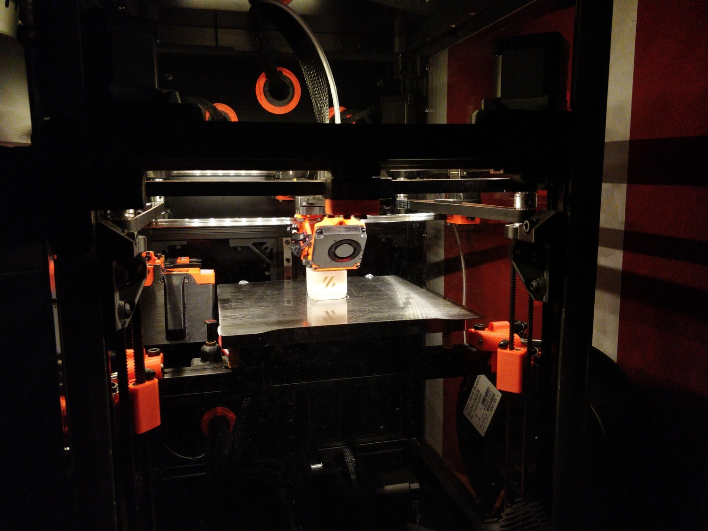

3D Printing Corner
------------------

This repository contains many of my 3D printing-related things including slicer
and firmware configuration. Unless explicitly stated otherwise, the contents of
this repository are licensed under the terms of the GPLv3.

## Printers

Here is a list of my DIY 3D printer builds:

### Voron V0.2

My first self-sourced 3D printer developed by the Voron Design team licensed
under the GPL. Voron owners can request a serial number for their printer builds
to mark the major milestone of completing a functioning printer (requirements
are showing a working printer with proper cable management).

The [V0][Voron02] is a truly tiny printer encompassing a print volume of about
120mmx120mmx120mm. Typical for a Voron, the V0 has an enclosure and thus is
ready to print more demanding filaments like ABS.

Originally built as a V0.0, this printer has later been updated to version V0.2.

<!---->

Serial number: V0.378

[Voron02]: https://vorondesign.com/voron0.2

#### Notable components

After having made bad experiences with a poor quality frame on the V0.0, I
decided to replace it entirely with one made by LDO. Opting for red extrusions
since my primary filament would only come in black allowed this build to still
have some color. I've also decided reach into the LDO box of V0 candy in few
more places, replacing the stock bed carriage with a Kirigami bed and a nice
stainless steel linear rail kit. Generic LED strips used for chamber lighting
have been replaced by Rainbow on a Matchstick PCBs. The old AC heat bed has been
retained as one of the handful of components surviving from the V0.0.

Really, the V0.2 upgrade has similarities with the Ship of Theseus thought
experiment.

Filament used: 3DO ASA Carbon Black (base), eSUN ABS+ Grey (accent)

#### Mods

- [Kirigami bed](https://github.com/christophmuellerorg/voron_0_kirigami_bed), [LDO version](https://www.ldomotion.com/#/guide/Kirigami-Bed-for-Voron-V02)
- [LDO Picobilical PCB](https://github.com/MotorDynamicsLab/LDO-Picobilical)
- [Rainbow on a Matchstick](https://github.com/VoronDesign/Voron-Hardware/tree/master/Daylight/Rainbow_on_a_matchstick)
- [keystone rear skirt](https://github.com/VoronDesign/VoronUsers/tree/master/printer_mods/hartk1213/Voron0.2_Rear_Keystone_Skirt)
- [MGN9C X carriage with heatset inserts](https://github.com/chirpy2605/voron/blob/7fd4c14f8522c0ba24a68b3ca5d526d07e72dc82/V0/v0.2_Stuff/STLs/MGN9C_X_Carriage_Inserts.stl)
- [DIN rail mount](https://www.printables.com/model/396278-voron-v0-din-rail-washer-and-endcap)
- PSU mounting plate (first time designing my own printer mod)

#### Voron V0.0

This is the first incantation of the V0 build.

##### Notable components

This V0.0 used stock components throughout, including the OMC V0 stepper motor
kit and CNA (RDBB) MGN7 linear rails. The hotend is a Trianglelab Dragon
Standard Flow. The bedheater is specifically made for the V0 bed (custom
fermiolabs) and I had to replace the stock GDStime part cooling fans with ones
from Delta due to reliability issues. I also opted to not use the stock AC inlet
solution instead chose a chassis-mount fused socket.

Filament used: KVP ABS Stellar Black (base), KVP ABS Voron Red (accent)

##### Mods

- [rear skirt IEC inlet](https://github.com/VoronDesign/VoronUsers/pull/271)
- [bed Wago mounts](https://github.com/VoronDesign/VoronUsers/tree/master/printer_mods/deepfriedheroin/v0_bed_wagos)
- [one part skirts](https://github.com/VoronDesign/VoronUsers/tree/master/printer_mods/Dan88/V0skirt)
- [LED strip mounts](https://discord.com/channels/460117602945990666/696930677161197640/808715506525012028)
- [honeycomb backpack divider](https://www.reddit.com/r/voroncorexy/comments/kyfzns/v0_serial_request_donatas8044/)
- [reverse bowden mount](https://github.com/VoronDesign/VoronUsers/blob/master/printer_mods/KiloQubit/V0_reverse_bowden_mount)
- [display](https://github.com/VoronDesign/Voron-Hardware/tree/master/V0_Display)

### Voron V2.4

After completing the V0.0 build I began working on another printer in the Voron
lineup: the [V2][Voron24]. This is a significantly bigger machine with a print
volume of about 300mmx300mmx270mm (in fact, you can put all of the V0 inside of
the V2).  The larger size affords packing the machine with more quality of life
features including automatic bed probing, a purge bucket, and [Z offset
calibration][ZCalibration].

One of the special features of this build is the use of the classical
[Noctua][NoctuaHomepage] "poop-stain and creme" color scheme.

Serial number: V2.2828

[Voron24]: https://vorondesign.com/voron2.4
[ZCalibration]: https://github.com/protoloft/klipper_z_calibration
[NoctuaHomepage]: https://noctua.at/

#### Notable components

The V2 build deviates from the stock recommended parts in more places than the
V0.0 did: The stepper motors are provided from the LDO V2 kit. On top have I
installed a BTT Octopus controller board and relays for separately controller
supply power to the bed and controller board from the Raspberry Pi. A
custom-sized heater sourced from fermiolabs is used here as well. Notably, the
exhaust filter is not populated rather the hole is blanked off relying on the
[Nevermore Micro][NevermoreMicroRepository] recirculating filter for air
cleanup. The toolhead also incorporates a number of changes. Beginning with the
Galileo planetary extruder replacing the Clockwork as well as improved part
cooling using a 5015 blower fan and optimized ducts.

Filament used: Ampertec ABS skin (base), eSUN ABS+ brown (accent)

[NevermoreMicroRepository]: https://github.com/nevermore3d/Nevermore_Micro

##### Notes on the Noctua colorscheme

Finding the right filament matching the chosen colorscheme was a bit of a
challenge. Noctua's classic colorscheme is Pantone PQ-483C (brown) and Pantone
PQ-2309C (beige) as found in [this Reddit thread][NoctuaColorsRedditThread].
Matching the beige is especially tough since most filament ranges' beige/skin
colors are more redish. People in the US have it easy as the high quality
[Paramount ABS skin (fair complexion)][ParamountABSBeige] filament is very close
to the Noctua tone (as [discovered][AccurazineV22] by Accurazine).
Unfortunately, this filament is not available in the EU requiring me to hunt for
new filament. I then stumbled upon the [Ampertec ABS skin][AmpertecABSSkin]
filament only sold in Germany and it matches Noctua's beige pretty closely as
well.

The brown is easier to match. Here I followed Accurazine's lead: ABS+ brown from
eSUN.

[NoctuaColorsRedditThread]: https://www.reddit.com/r/pcmods/comments/jp15zy/exact_noctua_fan_colors/
[ParamountABSBeige]: https://www.paramount-3d.com/product-page/abs-pantone-468c-skin-fair-complexion-1-75mm-1kg-filament-lirl1015468a
[AccurazineV22]: https://www.reddit.com/r/3Dprinting/comments/g9t2lj/noctuathemed_printed_parts_for_my_voron_22_build/
[AmpertecABSSkin]: https://www.filamentpreis.de/3dabs1000skn1am.html

#### Mods

- [270 degree door hinges](https://github.com/LoganFraser/VoronMods/tree/main/ParametricRemovable270Hinges)
- [Nevermore Micro V5 air filter](https://github.com/nevermore3d/Nevermore_Micro)
- [Afterburner 5015 part cooling mod](https://github.com/Greg191134/Voron/tree/master/Afterburner%20Optimisation/5015%20fan%20mod) and [Warbird optimized duct](https://github.com/Greg191134/Voron/tree/master/Afterburner%20Optimisation/The%20Warbird)
- [slim front idler](https://github.com/selliott79/Other-V2-Idlers)
- [bed Wago mounts](https://github.com/VoronDesign/VoronUsers/tree/master/printer_mods/deepfriedheroin/v2_bed_wagos)
- [closed off exhaust grill](https://github.com/VoronDesign/VoronUsers/tree/master/printer_mods/richardjm/back-plate)
- [skirt fan screw mounts](https://github.com/VoronDesign/VoronUsers/tree/master/printer_mods/StvPtrsn/Side_Fan_Support_No_Tape)
- [Galileo Clockwork extruder](https://github.com/JaredC01/Galileo)
- [Klicky detachable Z probe](https://github.com/jlas1/Klicky-Probe/)
- [pins mod](https://github.com/hartk1213/MISC/tree/main/Voron%20Mods/Voron%202/2.4/Voron2.4_Pins_Mod) (replacing screws holding bearings in the belt path with pins)
- [purge bucket](https://github.com/Annex-Engineering/Other_Printer_Mods/tree/master/All_Printers/Purge_Brush_Bucket)
- [spherical bearing Z joints](https://github.com/hartk1213/MISC/tree/main/Voron%20Mods/Voron%202/2.4/Voron2.4_GE5C)
- [beefed up Z drive tensioning](https://github.com/VoronDesign/VoronUsers/tree/master/printer_mods/edwardyeeks/V2.4_z_drive_motor_tensioner_mod)
- [sturdy top handles](https://github.com/VoronDesign/VoronUsers/tree/master/printer_mods/jeoje/Sturdy_Handles)
- [LED strip mounts](https://github.com/VoronDesign/VoronUsers/tree/master/printer_mods/eddie/LED_Bar_Clip)
- parts from other Voron printers:
  - Trident display and DIN rail mounts
  - V2.2 panel and Wago frame mounting

### Annex K3 R1 beta

I'm always on the lookout for interesting printer designs/kinematics and my eyes
fell on the cross gantry concept (most notably used in the Ultimaker 3D
printers) instead of yet another CoreXY build. The drawbacks of the design, like
higher costs due to more complex electronics and more motion components and less
space efficiency, are countered by the potential for reaching higher speeds.
This space hasn't been explored as much as CoreXY. The most advanced designs
seem to be released by Annex Engineering. My choice fell on the Annex K3 which
tries to increase space efficiency as much a possible as I'm used to from my
previous CoreXY builds.

The K3 is compact (for cross gantry printers anyway) and centered around a
180x180mm Prusa Mini-style bed. The ultra lightweight gantry coupled to four
stepper motors gives this printer ludicrous speed potential. A big drawback for
me compared to the Vorons is the more restrictive licensing of the Annex
designs.

At the time of the build, the K3 was still in open beta having only a pseudo-CAD
available requiring a proprietary viewer that is not available on Linux. There
was no manual and the fastener section in the BOM wasn't finalized. That being
said, the build went more smoothly than initially thought with the help of a
rough assembly order from the Annex Discord. The build relies more heavily on
custom-made components, specifically the enclosure uses quite a few
laser-cut/milled parts. Luckily, I was able to join a local group buy that
helped with sourcing enclosure panels.

Serial number: *there are no serial numbers for Annex printers, sadly.*

#### Notable components

With this build I'm trying out the NF Crazy (Slice Mosquito clone) hotend with a
Bondtech CHT nozzle for the first time and I'm liking it so far. However, more
notable is the use of the Double Folder Ascender extruder featuring worm gears.
This has been on my list of things to try out for a while. The worm gears give
the extruder interesting Pressure Advance properties. However, it is quite a bit
harder to source than the alternative Sherpa Mini.

Electronics follow the stock K3 build. It uses a frame thermistor in order to
enable [frame expansion compensation][ZAdjust]

Filament used: Prusament ASA Jet Black (base), and Prusa Orange (accent)

[ZAdjust]: https://www.klipper3d.org/Config_Reference.html#z_thermal_adjusthttps://www.klipper3d.org/Config_Reference.html#z_thermal_adjust

#### Mods

With the K3 being still in beta at the time of build and thus no released CAD,
the number of modifications available for it was rather limited. However the
stock build seems quite complete already making certain mods not really
necessary. One mod I installed was the beefed up version of the Double Folded
Ascender extruder released by StrikEagleCC.
