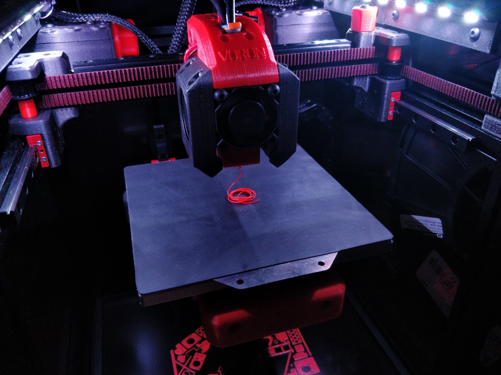
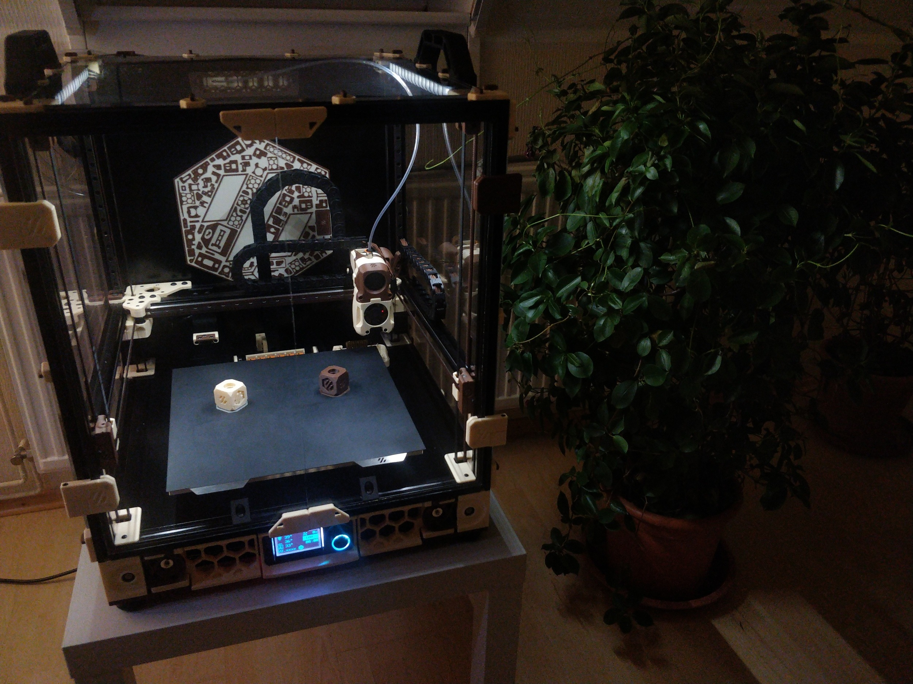

3D Printing Corner
------------------

This repository contains many of my 3D printing-related things including slicer
and firmware configuration. Unless explicitely stated otherwise, the contents of
this repository are licensed under the terms of the GPLv3.

## Printers

Here is a list my 3D printers:

### Voron V0.0

My first self-sourced 3D printer developed by the Voron Design team licensed
under the GPL. Vorons can request a serial number for their printer builds to
mark the major milestone of completing a functioning printer (requirements are
showing a working printer with proper cable management).

The V0 is a truly tiny printer encompassing a print volume of about
120mmx120mmx120mm. Typical for a Voron, the V0 has an enclosure and thus is
ready to print more demanding filaments like ABS.

Serial number: V0.378

#### Notable components

This V0 uses stock components throughout, including the OMC V0 stepper motor kit
and CNA (RDBB) MGN7 rails. Hotend is a Trianglelab Dragon Standard Flow.
Bedheaters is specifically made for the V0 bed (custom-made for fermiolabs) and
I had to replace the stock GDStime part cooling fans with ones from Delta due to
reliability issues. I also opted to not use the stock AC inlet solution instead
opting for a chassis-mount fused socket.

Filament used: KVP ABS Stellar Black (base), KVP ABS Voron Red (accent)

#### Mods

- [rear skirt IEC inlet](https://github.com/VoronDesign/VoronUsers/pull/271)
- [bed Wago mounts](https://github.com/VoronDesign/VoronUsers/tree/master/printer_mods/deepfriedheroin/v0_bed_wagos)
- [one part skirts](https://github.com/VoronDesign/VoronUsers/tree/master/printer_mods/Dan88/V0skirt)
- [LED strip mounts](https://discord.com/channels/460117602945990666/696930677161197640/808715506525012028)
- [honeycomb backpack divider](https://www.reddit.com/r/voroncorexy/comments/kyfzns/v0_serial_request_donatas8044/)
- [reverse bowden mount](https://github.com/VoronDesign/VoronUsers/blob/master/printer_mods/KiloQubit/V0_reverse_bowden_mount)
- [display](https://github.com/VoronDesign/Voron-Hardware/tree/master/V0_Display)

### Voron V2.4

After completing the V0 build I began working on another printer in the Voron
lineup: the V2. This is a significantly bigger machine with a print volume of
about 300mmx300mmx260mm (in fact, you can put whole V0 inside of the V2). The
larger size affords packing the machine with more quality of life features
including autmatic bed probing, a purge bucket, [Z offset calibration][ZCalibration], and [thermal expansion compensation][ThermalComp] 

One of the differenciating features of this build is the use of the classical
[Noctua][NoctuaHomepage] color scheme.

Serial number: V2.2828

[ZCalibration]: https://github.com/protoloft/klipper_z_calibration
[ThermalComp]: https://github.com/alchemyEngine/klipper_frame_expansion_comp
[NoctuaHomepage]: https://noctua.at/

#### Notable components

The V2 deviates from the stock recommended parts in more places than the V0: The
stepper motors are provided from the LDO V2 kit. On top have I installed a BTT
Octopus controller board and relays for separately controller supply power to
the bed and controller board from the Raspberry Pi. A custom-sized heater
sourced from fermiolabs is used here as well. Notably, the exhaust filter is not
populated rather the hole is blanked off relying on the
[Nevermore Micro][NevermoreMicroRepository] recirculating filter for air
cleanup. The toolhead also incorporated a number of changes. Beginning with the
Galileo planetary extruder replacing the Clockwork as well as improved part
cooling using a 5015 blower fan optimized ducts.

Filament used: Ampertec ABS skin (base), eSUN ABS+ brown (accent)

[NevermoreMicroRepository]: https://github.com/nevermore3d/Nevermore_Micro

##### Notes on the Noctua colorscheme

Finding the right filament matching the chosen colorscheme was a bit of a
challenge. Noctua's classic colorscheme is Pantone PQ-483C (brown) and Pantone
PQ-2309C (beige) as found in [this Reddit thread][NoctuaColorsRedditThread].
Matching the beige is especially tough since most filament ranges' beige/skin
colors are more redish. People in the US have it easy as the high quality
[Paramount ABS skin (fair complexion)][ParamountABSBeige] filament is very close
to the Noctua tone (as [discovered][AccurazineV22] by Accurazine).
Unfortunately, this filament is not available in the EU requiring me to hunt for
new filament. I then stumbled upon the [Ampertec ABS skin][AmpertecABSSkin]
filament only sold in Germany and it matches Noctua's beige pretty closely as
well.

The brown is easier to match. Here I followed Accurazine's lead: ABS+ brown from
eSUN.

[NoctuaColorsRedditThread]: https://www.reddit.com/r/pcmods/comments/jp15zy/exact_noctua_fan_colors/
[ParamountABSBeige]: https://www.paramount-3d.com/product-page/abs-pantone-468c-skin-fair-complexion-1-75mm-1kg-filament-lirl1015468a
[AccurazineV22]: https://www.reddit.com/r/3Dprinting/comments/g9t2lj/noctuathemed_printed_parts_for_my_voron_22_build/
[AmpertecABSSkin]: https://www.filamentpreis.de/3dabs1000skn1am.html

#### Mods

- [270 degree door hinges](https://github.com/LoganFraser/VoronMods/tree/main/ParametricRemovable270Hinges)
- [Nevermore Micro V5 air filter](https://github.com/nevermore3d/Nevermore_Micro)
- [Afterburner 5015 part cooling mod](https://github.com/Greg191134/Voron/tree/master/Afterburner%20Optimisation/5015%20fan%20mod) and [Warbird optimized duct](https://github.com/Greg191134/Voron/tree/master/Afterburner%20Optimisation/The%20Warbird)
- [slim front idler](https://github.com/selliott79/Other-V2-Idlers)
- [bed Wago mounts](https://github.com/VoronDesign/VoronUsers/tree/master/printer_mods/deepfriedheroin/v2_bed_wagos)
- [closed off exhaust grill](https://github.com/VoronDesign/VoronUsers/tree/master/printer_mods/richardjm/back-plate)
- [skirt fan screw mounts](https://github.com/VoronDesign/VoronUsers/tree/master/printer_mods/StvPtrsn/Side_Fan_Support_No_Tape)
- [Galileo Clockwork extruder](https://github.com/JaredC01/Galileo)
- [Klicky detachable Z probe](https://github.com/jlas1/Klicky-Probe/)
- [pins mod](https://github.com/hartk1213/MISC/tree/main/Voron%20Mods/Voron%202/2.4/Voron2.4_Pins_Mod) (replacing screws holding bearings in the belt path with pins)
- [purge bucket](https://github.com/Annex-Engineering/Other_Printer_Mods/tree/master/All_Printers/Purge_Brush_Bucket)
- [spherical bearing Z joints](https://github.com/hartk1213/MISC/tree/main/Voron%20Mods/Voron%202/2.4/Voron2.4_GE5C)
- [beefed up Z drive tensioning](https://github.com/VoronDesign/VoronUsers/tree/master/printer_mods/edwardyeeks/V2.4_z_drive_motor_tensioner_mod)
- [sturdy top handles](https://github.com/VoronDesign/VoronUsers/tree/master/printer_mods/jeoje/Sturdy_Handles)
- [LED strip mounts](https://github.com/VoronDesign/VoronUsers/tree/master/printer_mods/eddie/LED_Bar_Clip)
- parts from other Voron printers:
  - Trident display and DIN rail mounts
  - V2.2 panel and Wago frame mounting
