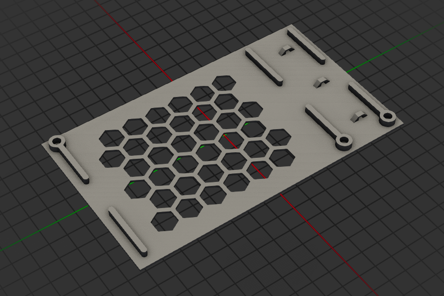

V0.2 PSU mounting bracket
=========================

This PSU mounting bracket allows screwing down the V0 PSU instead of taping it
with 3M VHB or drilling holes in the deck panel. Rather, this bracket itself is
taped to the deck panel, allowing for easy swapping of PSUs. This supports both
the Meanwell LRS-100 and LRS-150 power supplies. Needs Voron-spec heatset
inserts (M3x5x4mm) and M3x6mm screws (BHCS or SHCS both work).

At this time only tested with the LRS-100.

This bracket is heavily inspired by [BlueBear's Deck Panel
Backpack][DeckPanelBackpack], which I enjoyed using in my V0.0 build. Due to the
new Z-axis setup, it no longer fits into the V0.2, thus I had to come up with my
own solution

[DeckPanelBackpack]: https://github.com/VoronDesign/VoronUsers/tree/41737fdc4be8a9b6ad6515d3085671b9876ebcde/printer_mods/BlueBear/Deck_Panel_Backpack

CAD
---

This model was generated via OpenSCAD using the BOSL2 library. Versions used:

- OpenSCAD 2021.01
- BOSL2 2.0.669 (released 2023-12-18)

CAD source may or may not be compatible with later versions of mentioned
components.
